# Keamanan Jaringan

Berikut adalah hasil kerja saya:

## Setting up Honeypot (Cowrie)
## 1. Sudo apt update && sudo apt upgrade -y

## 2. Install dependencies

## 3. Create Cowrie User

## 4. Install Cowrie 

## 5. Create && Activate Python Virtual Environment

## 6. Install Dependencies

## 7. Copy Default Config & Start Cowrie Through Virtual Environment

## 8. Create A Symlink To The Real Cowrie Script

## 9. Verify If Symlink Exist & Start Cowrie From Bin/ Command

## 10. Create A Systemd Service File For Automating Cowrie

## 11. Start Cowrie

## 12. SSH Succeed

## 13. Double Network Adapter (Nat && Host-Only) & Static IP Setting

## Setting up Wazuh Manager (Dashboard Included with Manager)

## 1. Installing Wazuh Manager
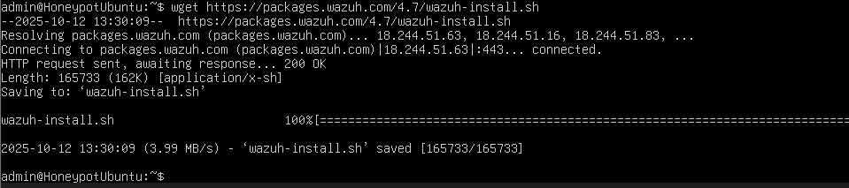
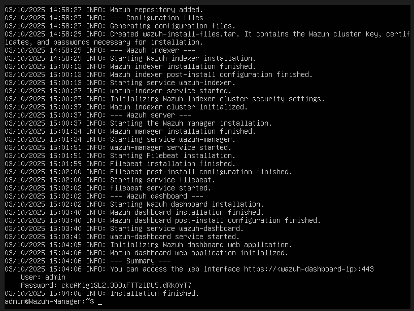

## 2. Setting Static IP For Manager VM
.png)
.png)

## Wazuh Agent && Dashboard

## 1. Wazuh Agent Installed and running & Connecting To Dashboard

## Attack Testing

## 1. Scanning

## 2. Brute Force

## 3. DDOS

##
##

## Pengenalan Firewall di Linux
## Menggunakan iptables (Default di Kali)
## Lihat aturan saat ini:
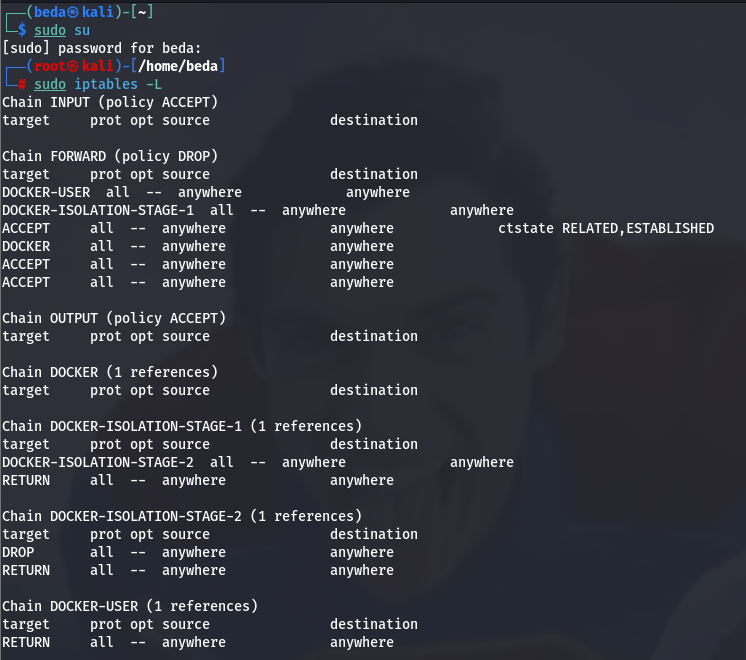
## Izinkan koneksi dari localhost dan izinkan akses SSH (port 22):
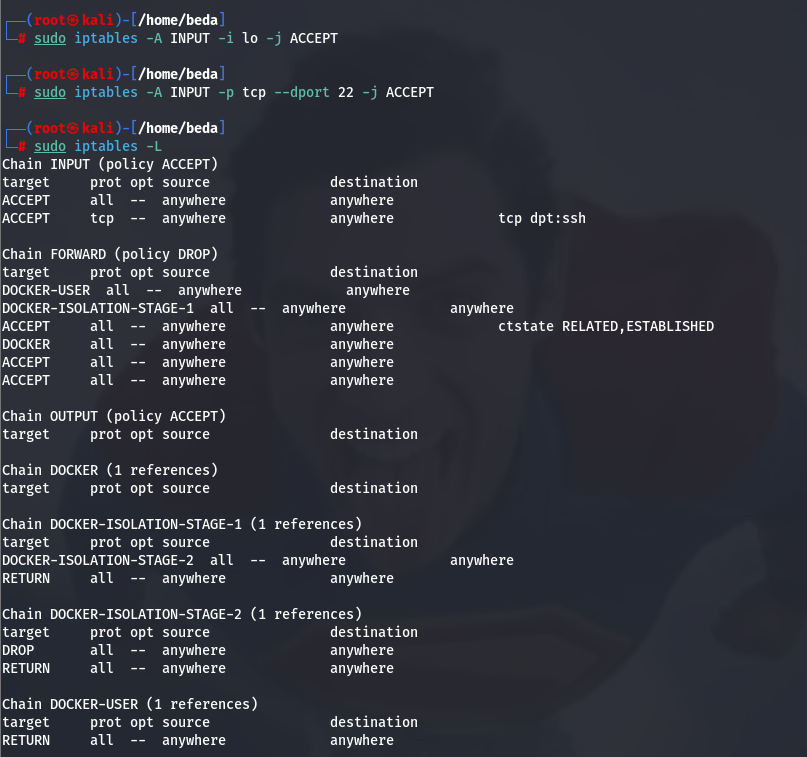
## Simpan aturan agar tetap ada setelah reboot:
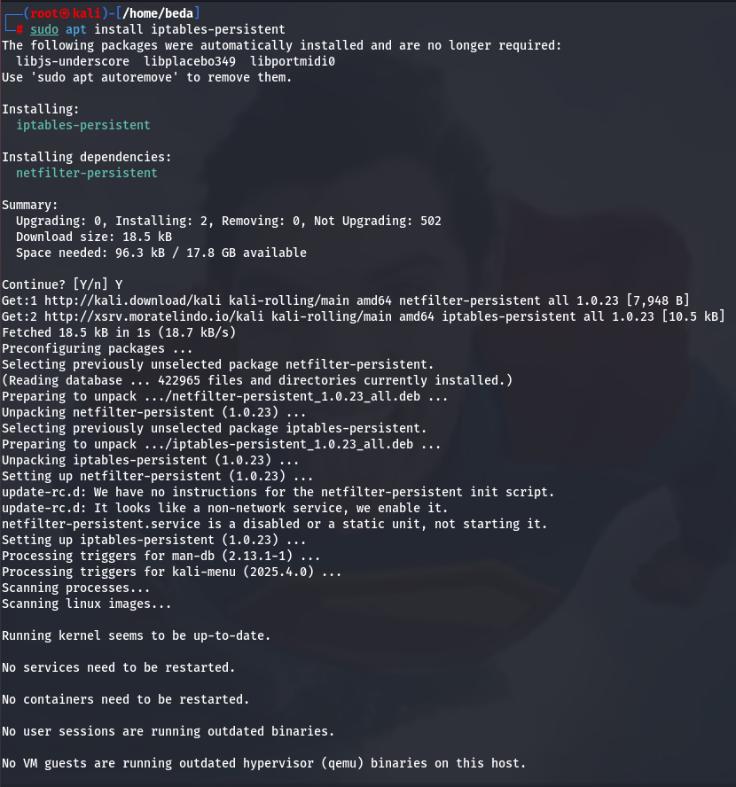
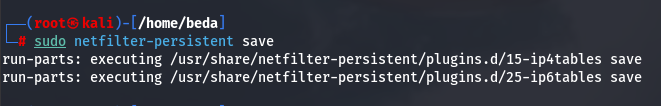
##
## Gunakan iptables untuk Filter Lebih Detail
## Bersihkan aturan lama
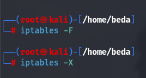
## Menetapkan Kebijakan Default
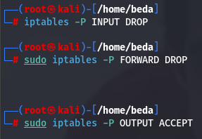
## Izinkan loopback
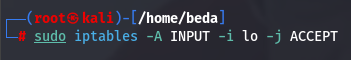
## Izinkan koneksi established/related
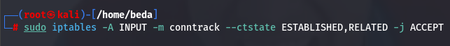
## Izinkan SSH hanya dari host (192.168.56.1)
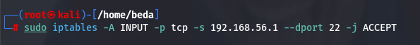
## Simpan aturan
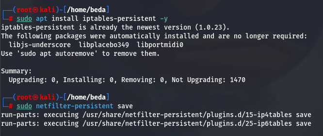
##
##
## Session 1 bidirectional ping
## Ping dari kali ke windows dan windows ke kali
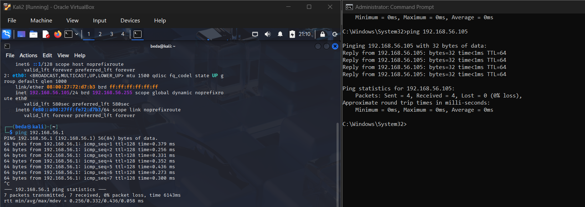
## Analisis wireshark
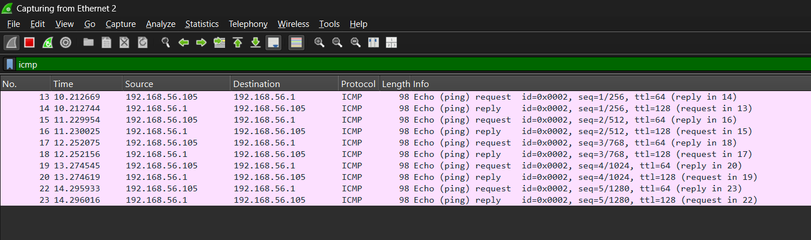
## Hasil tcpdump
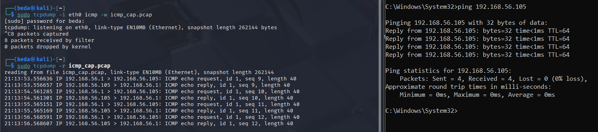
##
##
## Session 2 Flood Simulation
## lakukan flooding ke ip windows dan analisis menggunakan wireshark
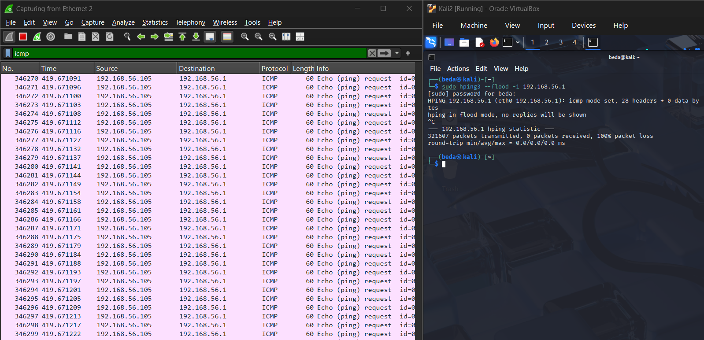
