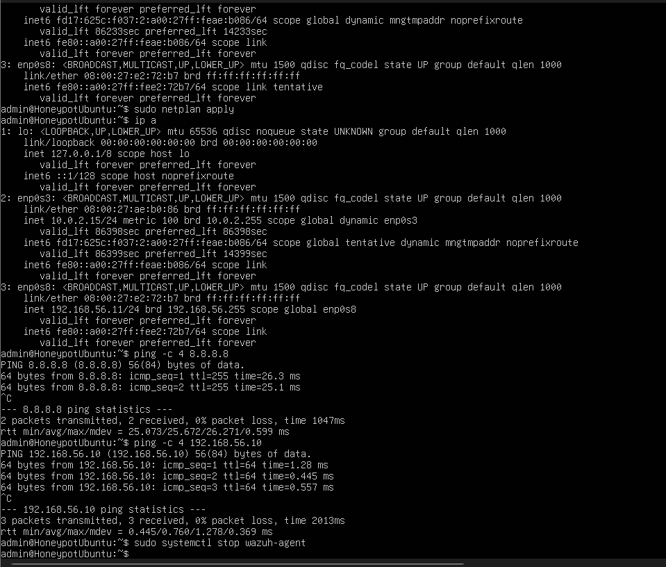

# Keamanan Jaringan

Berikut adalah hasil konfigurasi saya:

## 1. Instalasi Wazuh Manager

## 2. Setting Static IP di Ubuntu Server

## 3. Aktivasi Cowrie

## 4. Otomatisasi Cowrie 

## 5. SSH Berhasil

## 6. Dual Network settings && pre-wazuh agent install

## 7. Finished setting up honeypot(cowrie & wazuh agent) [in ubuntu server] & Wazuh Manager [in ubuntu server] (dashboard (kali) included)
.png)
